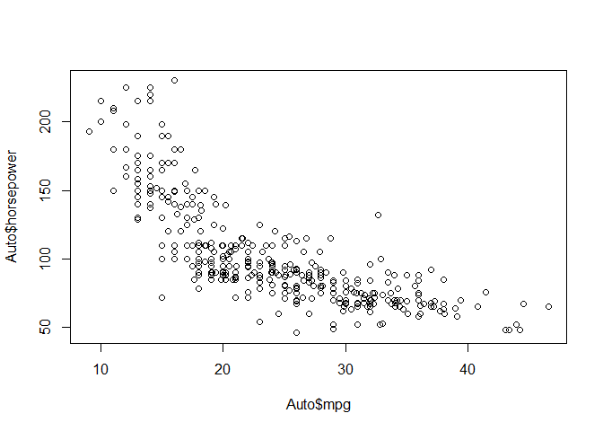
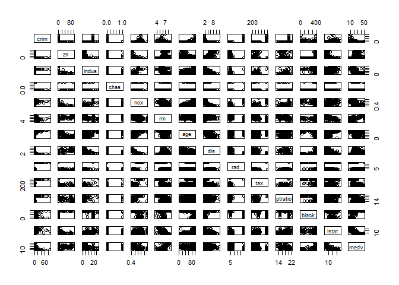
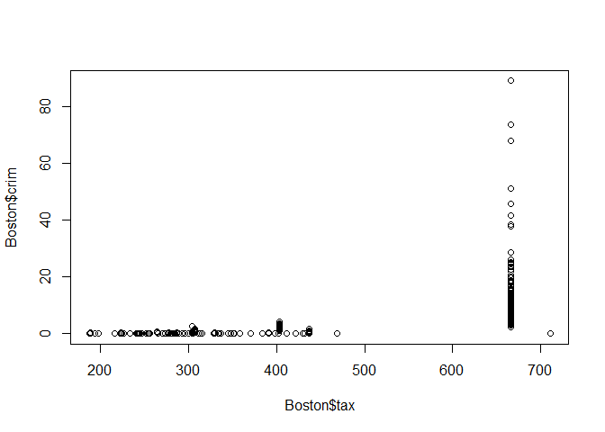
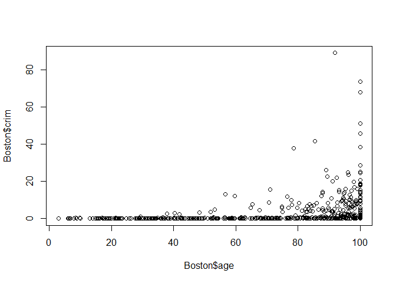
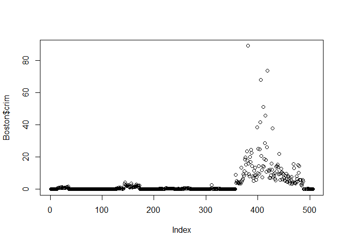

2. Explain whether each scenario is a classification or regression problem,
and indicate whether we are most interested in inference or prediction.
Finally, provide n and p.

(a) We collect a set of data on the top 500 firms in the US. For each
firm we record profit, number of employees, industry and the
CEO salary. We are interested in understanding which factors
affect CEO salary.

**Regression, inference. CEO salary is quantitative and we want to infer what factors affect it  
n = 500 firms, p = profit, # employees, industry**

(b) We are considering launching a new product and wish to know
whether it will be a success or a failure. We collect data on 20
similar products that were previously launched. For each product
we have recorded whether it was a success or failure, price
charged for the product, marketing budget, competition price,
and ten other variables.

**Classification, prediction. Success vs failure is qualitative and we want to predict for a new product  
n = 20 similar products, p = price, marketing, competition price, 10 other variables**

(c) We are interest in predicting the % change in the USD/Euro
exchange rate in relation to the weekly changes in the world
stock markets. Hence we collect weekly data for all of 2012. For
each week we record the % change in the USD/Euro, the %
change in the US market, the % change in the British market,
and the % change in the German market.

**Regression, prediction. %change is quantiative and we want to predict it for the future.  
n = 52 weekly data points from 2012. p = %change US, %change UK, %change GR**

7. The table below provides a training data set containing six observations,
three predictors, and one qualitative response variable.

|Obs.| X1| X2|   X3 |     Y|Dist|
|---:|--:|--:|-----:|:-----|---:|
|1   |  0|  3|     0|   Red|   3|
|2   |  2|  0|     0|   Red|   2|
|3   |  0|  1|     3|   Red| sqrt(10)|
|4   |  0|  1|     2| Green| sqrt(5)|
|5   | −1|  0|     1| Green|  sqrt(2)|
|6   |  1|  1|     1|   Red|  sqrt(3)|

Suppose we wish to use this data set to make a prediction for Y when
X1 = X2 = X3 = 0 using K-nearest neighbors.

(a) Compute the Euclidean distance between each observation and
the test point, X1 = X2 = X3 = 0.

(b) What is our prediction with K = 1? Why?

**We predict Green, because 0 is closest to #5 which is also green**

(c) What is our prediction with K = 3? Why?

**We predict Red, because #5, 6, and 2 are the closest. Two of three of those are red**

(d) If the Bayes decision boundary in this problem is highly nonlinear,
then would we expect the best value for K to be large or
small? Why?

**Small. Like we saw in the earlier example, when you have a large k (like k = 100) the boundary looks very linear, because so many points are taken into consideration that the nuances are lost**

8. Optional

9. This exercise involves the Auto data set studied in the lab. Make sure
that the missing values have been removed from the data.

```r
library(ISLR)
Auto <- na.omit(Auto)
#?Auto
```

(a) Which of the predictors are quantitative, and which are qualitative?

**Quantitative: mpg, cylinders, displacement, horsepower, weight, acceleration, year**  
**Qualitative: origin, name**

(b) What is the range of each quantitative predictor? 

```r
sapply(Auto[,1:7], range)
```

```
##       mpg cylinders displacement horsepower weight acceleration year
## [1,]  9.0         3           68         46   1613          8.0   70
## [2,] 46.6         8          455        230   5140         24.8   82
```


(c) What is the mean and standard deviation of each quantitative
predictor?

```r
sapply(Auto[,1:7], mean)
```

```
##          mpg    cylinders displacement   horsepower       weight 
##    23.445918     5.471939   194.411990   104.469388  2977.584184 
## acceleration         year 
##    15.541327    75.979592
```

```r
sapply(Auto[,1:7], sd)
```

```
##          mpg    cylinders displacement   horsepower       weight 
##     7.805007     1.705783   104.644004    38.491160   849.402560 
## acceleration         year 
##     2.758864     3.683737
```

(d) Now remove the 10th through 85th observations. What is the
range, mean, and standard deviation of each predictor in the
subset of the data that remains?

```r
Auto2 <- Auto[-(10:85), ]
sapply(Auto2[,1:7], range)
```

```
##       mpg cylinders displacement horsepower weight acceleration year
## [1,] 11.0         3           68         46   1649          8.5   70
## [2,] 46.6         8          455        230   4997         24.8   82
```

```r
sapply(Auto2[,1:7], mean)
```

```
##          mpg    cylinders displacement   horsepower       weight 
##    24.404430     5.373418   187.240506   100.721519  2935.971519 
## acceleration         year 
##    15.726899    77.145570
```

```r
sapply(Auto2[,1:7], sd)
```

```
##          mpg    cylinders displacement   horsepower       weight 
##     7.867283     1.654179    99.678367    35.708853   811.300208 
## acceleration         year 
##     2.693721     3.106217
```

(e) Using the full data set, investigate the predictors graphically,
using scatterplots or other tools of your choice. Create some plots
highlighting the relationships among the predictors. Comment
on your findings.


```r
pairs(Auto)
```

<!-- -->


(f) Suppose that we wish to predict gas mileage (mpg) on the basis
of the other variables. Do your plots suggest that any of the
other variables might be useful in predicting mpg? Justify your
answer.


```r
plot(Auto$mpg, Auto$horsepower)
```

<!-- -->

**Most of the plots involving mpg show that there is some correlation between mpg and the other traits.**

10. This exercise involves the Boston housing data set.


```r
library(MASS)
#?Boston
```

(a) How many rows are in this data set? How many columns? What
do the rows and columns represent?

```r
nrow(Boston)
```

```
## [1] 506
```

```r
ncol(Boston)
```

```
## [1] 14
```

**Rows: Housing observations. Columns: Traits of the observations.**

(b) Make some pairwise scatterplots of the predictors (columns) in
this data set. Describe your findings.


```r
pairs(Boston)
```

<!-- -->


(c) Are any of the predictors associated with per capita crime rate?
If so, explain the relationship.


```r
plot(Boston$tax, Boston$crim)
```

<!-- -->

```r
plot(Boston$age, Boston$crim)
```

<!-- -->

**Most show a pattern. Like older homes = more crime, or higher tax = more crime. **

(d) Do any of the suburbs of Boston appear to have particularly
high crime rates? Tax rates? Pupil-teacher ratios? Comment on
the range of each predictor.


```r
sapply(Boston, range)
```

```
##          crim  zn indus chas   nox    rm   age     dis rad tax ptratio
## [1,]  0.00632   0  0.46    0 0.385 3.561   2.9  1.1296   1 187    12.6
## [2,] 88.97620 100 27.74    1 0.871 8.780 100.0 12.1265  24 711    22.0
##       black lstat medv
## [1,]   0.32  1.73    5
## [2,] 396.90 37.97   50
```

```r
plot(Boston$crim)
```

<!-- -->


(e) How many of the suburbs in this data set bound the Charles river?

```r
nrow(Boston[Boston$chas==1,])
```

```
## [1] 35
```


(f) What is the median pupil-teacher ratio among the towns in this
data set?

```r
median(Boston$ptratio)
```

```
## [1] 19.05
```


(g) Which suburb of Boston has lowest median value of owneroccupied
homes? What are the values of the other predictors
for that suburb, and how do those values compare to the overall
ranges for those predictors? Comment on your findings.


```r
Boston[Boston$medv == min(Boston$medv),]
```

```
##        crim zn indus chas   nox    rm age    dis rad tax ptratio  black
## 399 38.3518  0  18.1    0 0.693 5.453 100 1.4896  24 666    20.2 396.90
## 406 67.9208  0  18.1    0 0.693 5.683 100 1.4254  24 666    20.2 384.97
##     lstat medv
## 399 30.59    5
## 406 22.98    5
```

```r
sapply(Boston, range)
```

```
##          crim  zn indus chas   nox    rm   age     dis rad tax ptratio
## [1,]  0.00632   0  0.46    0 0.385 3.561   2.9  1.1296   1 187    12.6
## [2,] 88.97620 100 27.74    1 0.871 8.780 100.0 12.1265  24 711    22.0
##       black lstat medv
## [1,]   0.32  1.73    5
## [2,] 396.90 37.97   50
```

(h) In this data set, how many of the suburbs average more than
seven rooms per dwelling? More than eight rooms per dwelling?
Comment on the suburbs that average more than eight rooms
per dwelling.


```r
nrow(Boston[Boston$rm > 7,])
```

```
## [1] 64
```

```r
nrow(Boston[Boston$rm > 8,])
```

```
## [1] 13
```

```r
summary(Boston[Boston$rm > 8,])
```

```
##       crim               zn            indus             chas       
##  Min.   :0.02009   Min.   : 0.00   Min.   : 2.680   Min.   :0.0000  
##  1st Qu.:0.33147   1st Qu.: 0.00   1st Qu.: 3.970   1st Qu.:0.0000  
##  Median :0.52014   Median : 0.00   Median : 6.200   Median :0.0000  
##  Mean   :0.71879   Mean   :13.62   Mean   : 7.078   Mean   :0.1538  
##  3rd Qu.:0.57834   3rd Qu.:20.00   3rd Qu.: 6.200   3rd Qu.:0.0000  
##  Max.   :3.47428   Max.   :95.00   Max.   :19.580   Max.   :1.0000  
##       nox               rm             age             dis       
##  Min.   :0.4161   Min.   :8.034   Min.   : 8.40   Min.   :1.801  
##  1st Qu.:0.5040   1st Qu.:8.247   1st Qu.:70.40   1st Qu.:2.288  
##  Median :0.5070   Median :8.297   Median :78.30   Median :2.894  
##  Mean   :0.5392   Mean   :8.349   Mean   :71.54   Mean   :3.430  
##  3rd Qu.:0.6050   3rd Qu.:8.398   3rd Qu.:86.50   3rd Qu.:3.652  
##  Max.   :0.7180   Max.   :8.780   Max.   :93.90   Max.   :8.907  
##       rad              tax           ptratio          black      
##  Min.   : 2.000   Min.   :224.0   Min.   :13.00   Min.   :354.6  
##  1st Qu.: 5.000   1st Qu.:264.0   1st Qu.:14.70   1st Qu.:384.5  
##  Median : 7.000   Median :307.0   Median :17.40   Median :386.9  
##  Mean   : 7.462   Mean   :325.1   Mean   :16.36   Mean   :385.2  
##  3rd Qu.: 8.000   3rd Qu.:307.0   3rd Qu.:17.40   3rd Qu.:389.7  
##  Max.   :24.000   Max.   :666.0   Max.   :20.20   Max.   :396.9  
##      lstat           medv     
##  Min.   :2.47   Min.   :21.9  
##  1st Qu.:3.32   1st Qu.:41.7  
##  Median :4.14   Median :48.3  
##  Mean   :4.31   Mean   :44.2  
##  3rd Qu.:5.12   3rd Qu.:50.0  
##  Max.   :7.44   Max.   :50.0
```

```r
summary(Boston)
```

```
##       crim                zn             indus            chas        
##  Min.   : 0.00632   Min.   :  0.00   Min.   : 0.46   Min.   :0.00000  
##  1st Qu.: 0.08204   1st Qu.:  0.00   1st Qu.: 5.19   1st Qu.:0.00000  
##  Median : 0.25651   Median :  0.00   Median : 9.69   Median :0.00000  
##  Mean   : 3.61352   Mean   : 11.36   Mean   :11.14   Mean   :0.06917  
##  3rd Qu.: 3.67708   3rd Qu.: 12.50   3rd Qu.:18.10   3rd Qu.:0.00000  
##  Max.   :88.97620   Max.   :100.00   Max.   :27.74   Max.   :1.00000  
##       nox               rm             age              dis        
##  Min.   :0.3850   Min.   :3.561   Min.   :  2.90   Min.   : 1.130  
##  1st Qu.:0.4490   1st Qu.:5.886   1st Qu.: 45.02   1st Qu.: 2.100  
##  Median :0.5380   Median :6.208   Median : 77.50   Median : 3.207  
##  Mean   :0.5547   Mean   :6.285   Mean   : 68.57   Mean   : 3.795  
##  3rd Qu.:0.6240   3rd Qu.:6.623   3rd Qu.: 94.08   3rd Qu.: 5.188  
##  Max.   :0.8710   Max.   :8.780   Max.   :100.00   Max.   :12.127  
##       rad              tax           ptratio          black       
##  Min.   : 1.000   Min.   :187.0   Min.   :12.60   Min.   :  0.32  
##  1st Qu.: 4.000   1st Qu.:279.0   1st Qu.:17.40   1st Qu.:375.38  
##  Median : 5.000   Median :330.0   Median :19.05   Median :391.44  
##  Mean   : 9.549   Mean   :408.2   Mean   :18.46   Mean   :356.67  
##  3rd Qu.:24.000   3rd Qu.:666.0   3rd Qu.:20.20   3rd Qu.:396.23  
##  Max.   :24.000   Max.   :711.0   Max.   :22.00   Max.   :396.90  
##      lstat            medv      
##  Min.   : 1.73   Min.   : 5.00  
##  1st Qu.: 6.95   1st Qu.:17.02  
##  Median :11.36   Median :21.20  
##  Mean   :12.65   Mean   :22.53  
##  3rd Qu.:16.95   3rd Qu.:25.00  
##  Max.   :37.97   Max.   :50.00
```

