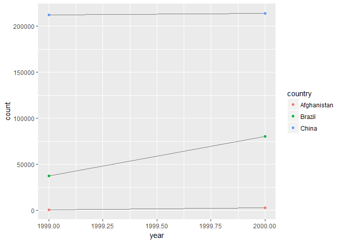

# June 14


## 12.2.1 
1. Each variable should have its own column. So instead of having one column for 1994, and one column for 1995, we should have one column for year. This may require "duplicating" rows, but this allows observations to all be in one row. 

2. 

```r
table1 %>% 
  mutate(rate = cases / population * 10000)
```

```
## # A tibble: 6 x 5
##       country  year  cases population     rate
##         <chr> <int>  <int>      <int>    <dbl>
## 1 Afghanistan  1999    745   19987071 0.372741
## 2 Afghanistan  2000   2666   20595360 1.294466
## 3      Brazil  1999  37737  172006362 2.193930
## 4      Brazil  2000  80488  174504898 4.612363
## 5       China  1999 212258 1272915272 1.667495
## 6       China  2000 213766 1280428583 1.669488
```

```r
cases <- table2[table2$type=="cases",]$count
country <- table2[table2$type=="cases",]$country
year <- table2[table2$type=="cases",]$year
population <- table2[table2$type=="population",]$count
table2_rate <- tibble(country = country,
       year = year,
       rate = cases / population)
table2_rate
```

```
## # A tibble: 6 x 3
##       country  year         rate
##         <chr> <int>        <dbl>
## 1 Afghanistan  1999 0.0000372741
## 2 Afghanistan  2000 0.0001294466
## 3      Brazil  1999 0.0002193930
## 4      Brazil  2000 0.0004612363
## 5       China  1999 0.0001667495
## 6       China  2000 0.0001669488
```

```r
#table4a$1999 won't work because 1999 begins with a number. Instead use [[]]
table4_rate <- tibble(country = table4a[["country"]],
       `1999` = table4a[["1999"]] / table4b[["1999"]],
       `2000` = table4b[["2000"]] / table4b[["2000"]])
```
3. 

```r
table2 %>% 
  filter(type == "cases") %>%
  ggplot(aes(year, count)) + 
  geom_line(aes(group = country), colour = "grey50") + 
  geom_point(aes(colour = country))
```

<!-- -->

## 12.3.3
1. 

```r
stocks <- tibble(
  year   = c(2015, 2015, 2016, 2016),
  half  = c(   1,    2,     1,    2),
  return = c(1.88, 0.59, 0.92, 0.17)
)
stocks
```

```
## # A tibble: 4 x 3
##    year  half return
##   <dbl> <dbl>  <dbl>
## 1  2015     1   1.88
## 2  2015     2   0.59
## 3  2016     1   0.92
## 4  2016     2   0.17
```

```r
stocks %>% 
  spread(year, return) %>% 
  gather("year", "return", `2015`:`2016`)
```

```
## # A tibble: 4 x 3
##    half  year return
##   <dbl> <chr>  <dbl>
## 1     1  2015   1.88
## 2     2  2015   0.59
## 3     1  2016   0.92
## 4     2  2016   0.17
```
Unsure what this question is. The order is changed, maybe because half comes before year alphabetically?

2. 

```r
table4a %>% 
  gather( `1999`, `2000`, key = "year", value = "cases")
```

```
## # A tibble: 6 x 3
##       country  year  cases
##         <chr> <chr>  <int>
## 1 Afghanistan  1999    745
## 2      Brazil  1999  37737
## 3       China  1999 212258
## 4 Afghanistan  2000   2666
## 5      Brazil  2000  80488
## 6       China  2000 213766
```

```r
#> Error in combine_vars(vars, ind_list): Position must be between 0 and n
```
Numbers in gather default to column numbers, not names

3. 

```r
people <- tribble(
  ~name,             ~key,    ~value,
  #-----------------|--------|------
  "Phillip Woods",   "age",       45,
  "Phillip Woods",   "height",   186,
  "Phillip Woods",   "age",       50,
  "Jessica Cordero", "age",       37,
  "Jessica Cordero", "height",   156
)
```
Phillip's age shows up twice. Maybe we can add a rep column, to say this is the second time we measured Phillip's height, at a different age. 


4. 

```r
preg <- tribble(
  ~pregnant, ~male, ~female,
  "yes",     NA,    10,
  "no",      20,    12
)
preg %>% gather(key = sex, value = count, male, female)
```

```
## # A tibble: 4 x 3
##   pregnant    sex count
##      <chr>  <chr> <dbl>
## 1      yes   male    NA
## 2       no   male    20
## 3      yes female    10
## 4       no female    12
```
We need to gather because each row represents two observations.
Variables: Pregnancy, Sex, Count

## 12.4.3 Exercises
1. 

```r
tibble(x = c("a,b,c", "d,e,f,g", "h,i,j")) %>% 
  separate(x, c("one", "two", "three"), extra="drop")
```

```
## # A tibble: 3 x 3
##     one   two three
## * <chr> <chr> <chr>
## 1     a     b     c
## 2     d     e     f
## 3     h     i     j
```

```r
tibble(x = c("a,b,c", "d,e", "f,g,i")) %>% 
  separate(x, c("one", "two", "three"))
```

```
## Warning: Too few values at 1 locations: 2
```

```
## # A tibble: 3 x 3
##     one   two three
## * <chr> <chr> <chr>
## 1     a     b     c
## 2     d     e  <NA>
## 3     f     g     i
```
extra tells you what to do with excess values. Fill is the opposite. 

2. Remove lets you remove the old variable you just separated, similar to transmute. If you wanted to keep both, like in mutate, you would do remove=false. 

3. Unite puts everything together. You can't unite by position, separator, or group... but you can separate in different ways. 
