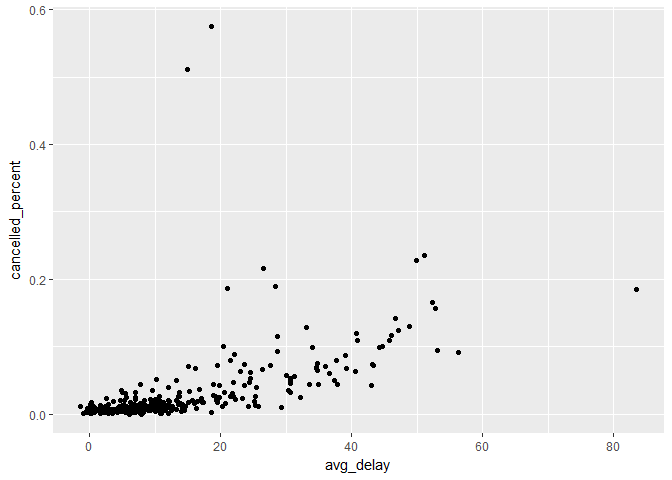
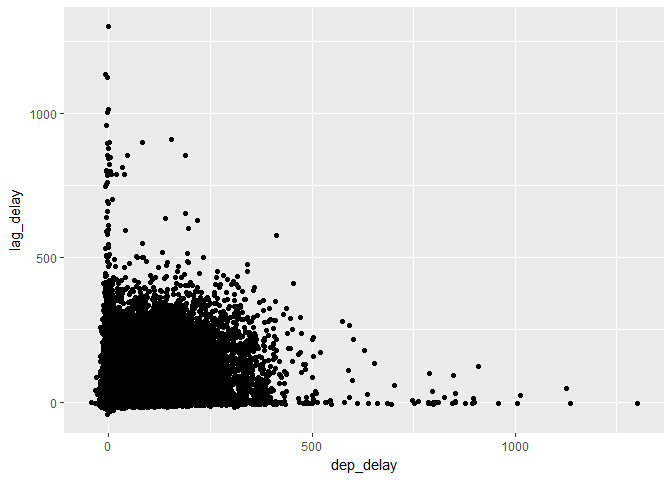

# May 17

5.6.7 Exercises


```r
library(nycflights13)
```

```
## Warning: package 'nycflights13' was built under R version 3.3.3
```

```r
library(tidyverse)
```

```
## Warning: package 'tidyverse' was built under R version 3.3.3
```

```
## Loading tidyverse: ggplot2
## Loading tidyverse: tibble
## Loading tidyverse: tidyr
## Loading tidyverse: readr
## Loading tidyverse: purrr
## Loading tidyverse: dplyr
```

```
## Warning: package 'tibble' was built under R version 3.3.3
```

```
## Warning: package 'tidyr' was built under R version 3.3.3
```

```
## Warning: package 'readr' was built under R version 3.3.3
```

```
## Warning: package 'purrr' was built under R version 3.3.3
```

```
## Conflicts with tidy packages ----------------------------------------------
```

```
## filter(): dplyr, stats
## lag():    dplyr, stats
```

```r
not_cancelled <- flights %>% 
  filter(!is.na(dep_delay), !is.na(arr_delay))

not_cancelled %>% 
  group_by(year, month, day) %>% 
  summarise(mean = mean(dep_delay))
```

```
## Source: local data frame [365 x 4]
## Groups: year, month [?]
## 
##     year month   day      mean
##    <int> <int> <int>     <dbl>
## 1   2013     1     1 11.435620
## 2   2013     1     2 13.677802
## 3   2013     1     3 10.907778
## 4   2013     1     4  8.965859
## 5   2013     1     5  5.732218
## 6   2013     1     6  7.145959
## 7   2013     1     7  5.417204
## 8   2013     1     8  2.558296
## 9   2013     1     9  2.301232
## 10  2013     1    10  2.844995
## # ... with 355 more rows
```

2. Come up with another approach that will give you the same output as not_cancelled %>% count(dest) and not_cancelled %>% count(tailnum, wt = distance) (without using count()).

```r
not_cancelled %>% group_by(dest) %>% summarise(n())
```

```
## # A tibble: 104 × 2
##     dest `n()`
##    <chr> <int>
## 1    ABQ   254
## 2    ACK   264
## 3    ALB   418
## 4    ANC     8
## 5    ATL 16837
## 6    AUS  2411
## 7    AVL   261
## 8    BDL   412
## 9    BGR   358
## 10   BHM   269
## # ... with 94 more rows
```

```r
not_cancelled %>% group_by(tailnum) %>% summarise(distance = sum(distance))
```

```
## # A tibble: 4,037 × 2
##    tailnum distance
##      <chr>    <dbl>
## 1   D942DN     3418
## 2   N0EGMQ   239143
## 3   N10156   109664
## 4   N102UW    25722
## 5   N103US    24619
## 6   N104UW    24616
## 7   N10575   139903
## 8   N105UW    23618
## 9   N107US    21677
## 10  N108UW    32070
## # ... with 4,027 more rows
```

3. Our definition of cancelled flights (is.na(dep_delay) | is.na(arr_delay) ) is slightly suboptimal. Why? Which is the most important column?

```r
flights %>% summarise(sum(is.na(dep_delay)))
```

```
## # A tibble: 1 × 1
##   `sum(is.na(dep_delay))`
##                     <int>
## 1                    8255
```

```r
flights %>% summarise(sum(is.na(arr_delay)))
```

```
## # A tibble: 1 × 1
##   `sum(is.na(arr_delay))`
##                     <int>
## 1                    9430
```
There are more NAs in arr_delay than dep_delay. Why? I don't know
It seems like dep_delay is more important because a cancelled flight will never take off...r ight?

4. Look at the number of cancelled flights per day. Is there a pattern? Is the proportion of cancelled flights related to the average delay?


```r
cancelled <- flights %>% mutate(cancelled = (is.na(arr_delay) | is.na(dep_delay))) %>%
  group_by(year, month, day) %>% summarise(cancelled_percent = mean(cancelled),
                                           avg_delay = mean(dep_delay, na.rm=TRUE))
cancelled
```

```
## Source: local data frame [365 x 5]
## Groups: year, month [?]
## 
##     year month   day cancelled_percent avg_delay
##    <int> <int> <int>             <dbl>     <dbl>
## 1   2013     1     1       0.013064133 11.548926
## 2   2013     1     2       0.015906681 13.858824
## 3   2013     1     3       0.015317287 10.987832
## 4   2013     1     4       0.007650273  8.951595
## 5   2013     1     5       0.004166667  5.732218
## 6   2013     1     6       0.003605769  7.148014
## 7   2013     1     7       0.003215434  5.417204
## 8   2013     1     8       0.007786429  2.553073
## 9   2013     1     9       0.009977827  2.276477
## 10  2013     1    10       0.003218884  2.844995
## # ... with 355 more rows
```

```r
ggplot(cancelled, aes(avg_delay, cancelled_percent)) + geom_point()
```

<!-- -->


5. Which carrier has the worst delays? Challenge: can you disentangle the effects of bad airports vs. bad carriers? Why/why not? (Hint: think about flights %>% group_by(carrier, dest) %>% summarise(n()))

```r
flights %>% group_by(carrier) %>% summarise(delay = mean(dep_delay, na.rm = TRUE)) %>% arrange(desc(delay))
```

```
## # A tibble: 16 × 2
##    carrier     delay
##      <chr>     <dbl>
## 1       F9 20.215543
## 2       EV 19.955390
## 3       YV 18.996330
## 4       FL 18.726075
## 5       WN 17.711744
## 6       9E 16.725769
## 7       B6 13.022522
## 8       VX 12.869421
## 9       OO 12.586207
## 10      UA 12.106073
## 11      MQ 10.552041
## 12      DL  9.264505
## 13      AA  8.586016
## 14      AS  5.804775
## 15      HA  4.900585
## 16      US  3.782418
```

```r
#F9 is the worst carrier

# Incomplete Challenge: 
# Number of flights to each destination by each carrier
(by_dest <- flights %>% group_by(carrier, dest) %>% summarise(n()))
```

```
## Source: local data frame [314 x 3]
## Groups: carrier [?]
## 
##    carrier  dest `n()`
##      <chr> <chr> <int>
## 1       9E   ATL    59
## 2       9E   AUS     2
## 3       9E   AVL    10
## 4       9E   BGR     1
## 5       9E   BNA   474
## 6       9E   BOS   914
## 7       9E   BTV     2
## 8       9E   BUF   833
## 9       9E   BWI   856
## 10      9E   CAE     3
## # ... with 304 more rows
```

```r
flights %>% group_by(carrier, dest) %>% summarise(delay=mean(dep_delay, na.rm=TRUE)) %>% summarise(mean(delay, na.rm=TRUE))
```

```
## # A tibble: 16 × 2
##    carrier `mean(delay, na.rm = TRUE)`
##      <chr>                       <dbl>
## 1       9E                   12.063336
## 2       AA                    9.895821
## 3       AS                    5.804775
## 4       B6                   12.892561
## 5       DL                    7.085287
## 6       EV                   20.122658
## 7       F9                   20.215543
## 8       FL                   12.519132
## 9       HA                    4.900585
## 10      MQ                   11.500179
## 11      OO                   27.588095
## 12      UA                   12.486018
## 13      US                    3.849073
## 14      VX                    5.016934
## 15      WN                   15.874691
## 16      YV                   11.998416
```

6. What does the sort argument to count() do. When might you use it?

```r
not_cancelled %>% count(dest, sort=T)
```

```
## # A tibble: 104 × 2
##     dest     n
##    <chr> <int>
## 1    ATL 16837
## 2    ORD 16566
## 3    LAX 16026
## 4    BOS 15022
## 5    MCO 13967
## 6    CLT 13674
## 7    SFO 13173
## 8    FLL 11897
## 9    MIA 11593
## 10   DCA  9111
## # ... with 94 more rows
```
It sorts by count. Seems like it could have been useful earlier when we used arrange

# 5.6.1 Exercises
1. The operations will apply to groups, not the whole data frame
2. Which plane (tailnum) has the worst on-time record?

```r
flights %>% group_by(tailnum) %>% summarise(mean_delay = mean(arr_delay, na.rm=TRUE)) %>% arrange(desc(mean_delay))
```

```
## # A tibble: 4,044 × 2
##    tailnum mean_delay
##      <chr>      <dbl>
## 1   N844MH   320.0000
## 2   N911DA   294.0000
## 3   N922EV   276.0000
## 4   N587NW   264.0000
## 5   N851NW   219.0000
## 6   N928DN   201.0000
## 7   N7715E   188.0000
## 8   N654UA   185.0000
## 9   N665MQ   174.6667
## 10  N427SW   157.0000
## # ... with 4,034 more rows
```

```r
#I hate flying on N844MH
```
3. What time of day should you fly if you want to avoid delays as much as possible? 

```r
flights %>% group_by(hour) %>% summarise(mean_delay = mean(arr_delay, na.rm=TRUE)) %>% arrange(mean_delay)
```

```
## # A tibble: 20 × 2
##     hour mean_delay
##    <dbl>      <dbl>
## 1      7 -5.3044716
## 2      5 -4.7969072
## 3      6 -3.3844854
## 4      9 -1.4514074
## 5      8 -1.1132266
## 6     10  0.9539401
## 7     11  1.4819300
## 8     12  3.4890104
## 9     13  6.5447397
## 10    14  9.1976501
## 11    23 11.7552783
## 12    15 12.3241920
## 13    16 12.5976412
## 14    18 14.7887244
## 15    22 15.9671618
## 16    17 16.0402670
## 17    19 16.6558736
## 18    20 16.6761098
## 19    21 18.3869371
## 20     1        NaN
```

```r
#7am wakin up in the morning
```
4. For each destination, compute the total minutes of delay. For each flight compute the proportion of the total delay for its destination. 

```r
not_cancelled %>% group_by(dest) %>% mutate(total_delay = sum(arr_delay), delay_percent = arr_delay / total_delay)
```

```
## Source: local data frame [327,346 x 21]
## Groups: dest [104]
## 
##     year month   day dep_time sched_dep_time dep_delay arr_time
##    <int> <int> <int>    <int>          <int>     <dbl>    <int>
## 1   2013     1     1      517            515         2      830
## 2   2013     1     1      533            529         4      850
## 3   2013     1     1      542            540         2      923
## 4   2013     1     1      544            545        -1     1004
## 5   2013     1     1      554            600        -6      812
## 6   2013     1     1      554            558        -4      740
## 7   2013     1     1      555            600        -5      913
## 8   2013     1     1      557            600        -3      709
## 9   2013     1     1      557            600        -3      838
## 10  2013     1     1      558            600        -2      753
## # ... with 327,336 more rows, and 14 more variables: sched_arr_time <int>,
## #   arr_delay <dbl>, carrier <chr>, flight <int>, tailnum <chr>,
## #   origin <chr>, dest <chr>, air_time <dbl>, distance <dbl>, hour <dbl>,
## #   minute <dbl>, time_hour <dttm>, total_delay <dbl>, delay_percent <dbl>
```

5. Use lag() to explore how the delay of a flight is related to the delay of the immediately preceeding flight.

```r
not_cancelled %>% mutate(lag_delay = lag(dep_delay)) %>%
  ggplot(aes(dep_delay, lag_delay)) + geom_point()
```

```
## Warning: Removed 1 rows containing missing values (geom_point).
```

<!-- -->
6. Look at each destination. Can you find flights that are suspiciously fast? (i.e. flights that represent a potential data entry error). Compute the air time a flight relative to the shortest flight to that destination. Which flights were most delayed in the air?


```r
not_cancelled %>% 
  group_by(dest) %>% 
  mutate(median = median(air_time), speed=(air_time - median), normalized=speed/median) %>% 
  arrange(normalized) %>%
  select(dest, median, normalized, air_time)
```

```
## Source: local data frame [327,346 x 4]
## Groups: dest [104]
## 
##     dest median normalized air_time
##    <chr>  <dbl>      <dbl>    <dbl>
## 1    BOS     38 -0.4473684       21
## 2    ATL    112 -0.4196429       65
## 3    GSP     92 -0.4021739       55
## 4    BOS     38 -0.3947368       23
## 5    BNA    113 -0.3805310       70
## 6    MSP    149 -0.3758389       93
## 7    CVG     95 -0.3473684       62
## 8    PIT     61 -0.3442623       40
## 9    PHL     32 -0.3437500       21
## 10   PHL     32 -0.3437500       21
## # ... with 327,336 more rows
```

```r
# Doesn't this not take into account origin? ..isn't that important?
```


7. Find all destinations that are flown by at least two carriers. Use that information to rank the carriers.
rank the carriers? what?


```r
#Counts rows, or number of flights per carrier per destination
flights %>% group_by(dest, carrier) %>% count(carrier)
```

```
## Source: local data frame [314 x 3]
## Groups: dest [?]
## 
##     dest carrier     n
##    <chr>   <chr> <int>
## 1    ABQ      B6   254
## 2    ACK      B6   265
## 3    ALB      EV   439
## 4    ANC      UA     8
## 5    ATL      9E    59
## 6    ATL      DL 10571
## 7    ATL      EV  1764
## 8    ATL      FL  2337
## 9    ATL      MQ  2322
## 10   ATL      UA   103
## # ... with 304 more rows
```

```r
#Counts rows, or number of destinations per carrier
flights %>% group_by(dest, carrier) %>% count(carrier) %>% group_by(carrier) %>% count()
```

```
## # A tibble: 16 × 2
##    carrier    nn
##      <chr> <int>
## 1       9E    49
## 2       AA    19
## 3       AS     1
## 4       B6    42
## 5       DL    40
## 6       EV    61
## 7       F9     1
## 8       FL     3
## 9       HA     1
## 10      MQ    20
## 11      OO     5
## 12      UA    47
## 13      US     6
## 14      VX     5
## 15      WN    11
## 16      YV     3
```

8. For each plane, count the number of flights before the first delay of greater than 1 hour.

```r
flights %>% group_by(tailnum) %>% mutate(delayed = dep_delay > 60) %>% mutate(beforeflights = cumsum(delayed)) %>% filter(beforeflights < 1) %>% count()
```

```
## # A tibble: 3,784 × 2
##    tailnum     n
##      <chr> <int>
## 1   N0EGMQ    39
## 2   N10156     9
## 3   N102UW    33
## 4   N103US    46
## 5   N104UW     6
## 6   N105UW    34
## 7   N107US    29
## 8   N108UW     9
## 9   N109UW    48
## 10  N110UW    26
## # ... with 3,774 more rows
```

