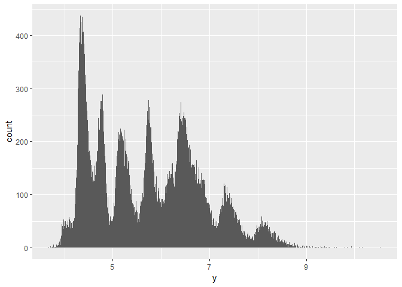

# May-24


## 7.2.4 Exercises
1. X and Y match up almost perfectly; they probably correspond to length and width. Z is probably depth. 

```r
ggplot(diamonds) + geom_freqpoly(aes(x, color="X")) + geom_freqpoly(aes(y, color="Y")) + geom_freqpoly(aes(z, color="Z")) + xlim(1,10)
```

<!-- -->

2. There might be two subgroups - cheaper, with a normalish distribution, and then a sudden dip around $1500, and then expensive diamonds that taper off with cost. 

```r
ggplot(diamonds) + geom_histogram(aes(price), binwidth=50)
```

<!-- -->

```r
diamonds %>% filter(price < 5000) %>% ggplot() + geom_histogram(aes(price), binwidth=50)
```

<!-- -->

3. There are 23 .99 carat diamonds and 1558 1.00 carat diamonds. Maybe there is some regulation about what is allowed to be marketed as a 1 carat diamond. 

```r
diamonds %>% filter(between(carat, 0.98, 1.01)) %>% count(carat)
```

```
## # A tibble: 4 x 2
##   carat     n
##   <dbl> <int>
## 1  0.98    31
## 2  0.99    23
## 3  1.00  1558
## 4  1.01  2242
```

4. coord_cartesian zooms in on the graph, but doesn't affect binwidth and other calculations. xlim is more like a filter; it gets rid of all the values that don't fall in the range, and then calculates the binwidth using only the remaining data. 

```r
diamonds %>% filter(price < 5000) %>% ggplot() + geom_histogram(aes(price)) + coord_cartesian(xlim = c(100, 1500))
```

```
## `stat_bin()` using `bins = 30`. Pick better value with `binwidth`.
```

<!-- -->

```r
diamonds %>% filter(price < 5000) %>% ggplot() + geom_histogram(aes(price)) + xlim(100, 1500)
```

```
## `stat_bin()` using `bins = 30`. Pick better value with `binwidth`.
```

```
## Warning: Removed 19203 rows containing non-finite values (stat_bin).
```

```
## Warning: Removed 1 rows containing missing values (geom_bar).
```

<!-- -->

# 7.4 Exercises
1. Not sure what the difference is. I'm told it's different if the variable we're looking at is discrete. geom_bar doesn't seem appropriate / what I expected it to be. 

```r
diamonds2 <- diamonds %>% 
  mutate(y = ifelse(y < 3 | y > 20, NA, y))
diamonds2 %>% ggplot() + geom_histogram(aes(y))
```

```
## `stat_bin()` using `bins = 30`. Pick better value with `binwidth`.
```

```
## Warning: Removed 9 rows containing non-finite values (stat_bin).
```

<!-- -->

```r
diamonds2 %>% ggplot() + geom_bar(aes(y))
```

```
## Warning: Removed 9 rows containing non-finite values (stat_count).
```

<!-- -->
2. If you try to add NA to something, the answer will be NA. na.rm removes NA values from the summation

```r
sum(diamonds$y)
```

```
## [1] 309320.3
```

```r
sum(diamonds2$y)
```

```
## [1] NA
```

```r
sum(diamonds2$y, na.rm=TRUE)
```

```
## [1] 309229.6
```

# 7.5 Exercises

```r
nycflights13::flights %>% 
  mutate(
    cancelled = is.na(dep_time),
    sched_hour = sched_dep_time %/% 100,
    sched_min = sched_dep_time %% 100,
    sched_dep_time = sched_hour + sched_min / 60
  ) %>% 
  ggplot(aes(x=cancelled, y=sched_dep_time)) + geom_boxplot()
```

<!-- -->
2. Taking too long to do this, but you could use pairs to see all pairwise correlations (or a subset)

```r
diamonds %>% ggplot() + geom_density(aes(price, color=cut))
```

<!-- -->

```r
pairs(diamonds[c(1,2,7,8)])
```

<!-- -->
3. coord_flip() can only flip the entire plot. ggstance can let you flip the individual components of a graph, like geoms. 

```r
ggplot(diamonds, aes(x=price, y=cut)) + geom_boxploth()
```

<!-- -->

```r
ggplot(diamonds) + geom_lv(aes(cut, price))
```

<!-- -->
4. lv boxplots are supposed to display more information about tails and give "quartiles" but for more than just 4 divisions

5. Geom_violin gives more data about the distribution of data


