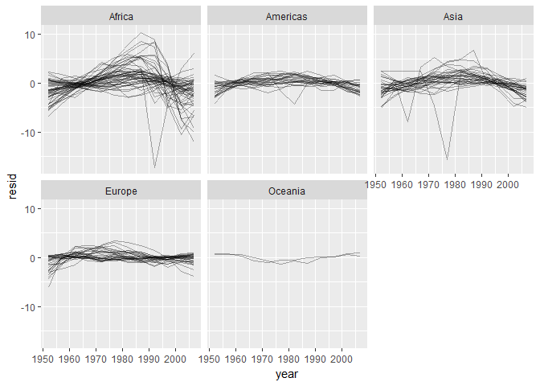

# November 8

Chaper 25: Many Models 


How does life expectancy change over time for each country? 


```r
gapminder %>% 
  ggplot(aes(year, lifeExp, group = country)) +
    geom_line(alpha = 1/3)
```

<!-- -->

there’s a strong signal (overall linear growth) that makes it hard to see subtler trends. We’ll tease these factors apart by fitting a model with a linear trend. The model captures steady growth over time, and the residuals will show what’s left.


```r
nz <- filter(gapminder, country == "New Zealand")
```

```
## Warning: package 'bindrcpp' was built under R version 3.4.1
```

```r
nz %>% 
  ggplot(aes(year, lifeExp)) + 
  geom_line() + 
  ggtitle("Full data = ")
```

<!-- -->

```r
nz_mod <- lm(lifeExp ~ year, data = nz)
nz %>% 
  add_predictions(nz_mod) %>%
  ggplot(aes(year, pred)) + 
  geom_line() + 
  ggtitle("Linear trend + ")
```

<!-- -->

```r
nz %>% 
  add_residuals(nz_mod) %>% 
  ggplot(aes(year, resid)) + 
  geom_hline(yintercept = 0, colour = "white", size = 3) + 
  geom_line() + 
  ggtitle("Remaining pattern")
```

<!-- -->

## 25.2.1 Nested Data


```r
by_country <- gapminder %>% 
  group_by(country, continent) %>% 
  nest()

by_country
```

```
## # A tibble: 142 x 3
##        country continent              data
##         <fctr>    <fctr>            <list>
##  1 Afghanistan      Asia <tibble [12 x 4]>
##  2     Albania    Europe <tibble [12 x 4]>
##  3     Algeria    Africa <tibble [12 x 4]>
##  4      Angola    Africa <tibble [12 x 4]>
##  5   Argentina  Americas <tibble [12 x 4]>
##  6   Australia   Oceania <tibble [12 x 4]>
##  7     Austria    Europe <tibble [12 x 4]>
##  8     Bahrain      Asia <tibble [12 x 4]>
##  9  Bangladesh      Asia <tibble [12 x 4]>
## 10     Belgium    Europe <tibble [12 x 4]>
## # ... with 132 more rows
```

in a grouped data frame, each row is an observation; in a nested data frame, each row is a group. Another way to think about a nested dataset is we now have a meta-observation: a row that represents the complete time course for a country, rather than a single point in time.

## 25.2.2 List-columns


```r
country_model <- function(df) {
  lm(lifeExp ~ year, data = df)
}

# The data frames are in a list, so we can use purrr:map()
models <- map(by_country$data, country_model)

by_country <- by_country %>% 
  mutate(model = map(data, country_model))
by_country
```

```
## # A tibble: 142 x 4
##        country continent              data    model
##         <fctr>    <fctr>            <list>   <list>
##  1 Afghanistan      Asia <tibble [12 x 4]> <S3: lm>
##  2     Albania    Europe <tibble [12 x 4]> <S3: lm>
##  3     Algeria    Africa <tibble [12 x 4]> <S3: lm>
##  4      Angola    Africa <tibble [12 x 4]> <S3: lm>
##  5   Argentina  Americas <tibble [12 x 4]> <S3: lm>
##  6   Australia   Oceania <tibble [12 x 4]> <S3: lm>
##  7     Austria    Europe <tibble [12 x 4]> <S3: lm>
##  8     Bahrain      Asia <tibble [12 x 4]> <S3: lm>
##  9  Bangladesh      Asia <tibble [12 x 4]> <S3: lm>
## 10     Belgium    Europe <tibble [12 x 4]> <S3: lm>
## # ... with 132 more rows
```

## 25.2.3 Unnesting

Add residuals to each data / model pair. We have 142 data frames and 142 models

```r
by_country <- by_country %>% 
  mutate(
    resids = map2(data, model, add_residuals)
  )
by_country
```

```
## # A tibble: 142 x 5
##        country continent              data    model            resids
##         <fctr>    <fctr>            <list>   <list>            <list>
##  1 Afghanistan      Asia <tibble [12 x 4]> <S3: lm> <tibble [12 x 5]>
##  2     Albania    Europe <tibble [12 x 4]> <S3: lm> <tibble [12 x 5]>
##  3     Algeria    Africa <tibble [12 x 4]> <S3: lm> <tibble [12 x 5]>
##  4      Angola    Africa <tibble [12 x 4]> <S3: lm> <tibble [12 x 5]>
##  5   Argentina  Americas <tibble [12 x 4]> <S3: lm> <tibble [12 x 5]>
##  6   Australia   Oceania <tibble [12 x 4]> <S3: lm> <tibble [12 x 5]>
##  7     Austria    Europe <tibble [12 x 4]> <S3: lm> <tibble [12 x 5]>
##  8     Bahrain      Asia <tibble [12 x 4]> <S3: lm> <tibble [12 x 5]>
##  9  Bangladesh      Asia <tibble [12 x 4]> <S3: lm> <tibble [12 x 5]>
## 10     Belgium    Europe <tibble [12 x 4]> <S3: lm> <tibble [12 x 5]>
## # ... with 132 more rows
```

```r
resids <- unnest(by_country, resids)
resids
```

```
## # A tibble: 1,704 x 7
##        country continent  year lifeExp      pop gdpPercap       resid
##         <fctr>    <fctr> <int>   <dbl>    <int>     <dbl>       <dbl>
##  1 Afghanistan      Asia  1952  28.801  8425333  779.4453 -1.10629487
##  2 Afghanistan      Asia  1957  30.332  9240934  820.8530 -0.95193823
##  3 Afghanistan      Asia  1962  31.997 10267083  853.1007 -0.66358159
##  4 Afghanistan      Asia  1967  34.020 11537966  836.1971 -0.01722494
##  5 Afghanistan      Asia  1972  36.088 13079460  739.9811  0.67413170
##  6 Afghanistan      Asia  1977  38.438 14880372  786.1134  1.64748834
##  7 Afghanistan      Asia  1982  39.854 12881816  978.0114  1.68684499
##  8 Afghanistan      Asia  1987  40.822 13867957  852.3959  1.27820163
##  9 Afghanistan      Asia  1992  41.674 16317921  649.3414  0.75355828
## 10 Afghanistan      Asia  1997  41.763 22227415  635.3414 -0.53408508
## # ... with 1,694 more rows
```

```r
resids %>% 
  ggplot(aes(year, resid)) +
    geom_line(aes(group = country), alpha = 1 / 3) + 
    geom_smooth(se = FALSE)
```

```
## `geom_smooth()` using method = 'gam'
```

<!-- -->

```r
resids %>% 
  ggplot(aes(year, resid, group = country)) +
    geom_line(alpha = 1 / 3) + 
    facet_wrap(~continent)
```

<!-- -->
## 25.2.4 Model Quality

Residuals are one way to evaluate model quality. 
the broom package also provides functions to turn models into tidy data
broom::glance extracts model quality metrics 


```r
broom::glance(nz_mod)
```

```
##   r.squared adj.r.squared     sigma statistic      p.value df    logLik
## 1 0.9535846     0.9489431 0.8043472  205.4459 5.407324e-08  2 -13.32064
##        AIC    BIC deviance df.residual
## 1 32.64128 34.096 6.469743          10
```


```r
glance <- by_country %>% 
  mutate(glance = map(model, broom::glance)) %>% 
  unnest(glance, .drop = TRUE)
glance
```

```
## # A tibble: 142 x 13
##        country continent r.squared adj.r.squared     sigma  statistic
##         <fctr>    <fctr>     <dbl>         <dbl>     <dbl>      <dbl>
##  1 Afghanistan      Asia 0.9477123     0.9424835 1.2227880  181.24941
##  2     Albania    Europe 0.9105778     0.9016355 1.9830615  101.82901
##  3     Algeria    Africa 0.9851172     0.9836289 1.3230064  661.91709
##  4      Angola    Africa 0.8878146     0.8765961 1.4070091   79.13818
##  5   Argentina  Americas 0.9955681     0.9951249 0.2923072 2246.36635
##  6   Australia   Oceania 0.9796477     0.9776125 0.6206086  481.34586
##  7     Austria    Europe 0.9921340     0.9913474 0.4074094 1261.29629
##  8     Bahrain      Asia 0.9667398     0.9634138 1.6395865  290.65974
##  9  Bangladesh      Asia 0.9893609     0.9882970 0.9766908  929.92637
## 10     Belgium    Europe 0.9945406     0.9939946 0.2929025 1821.68840
## # ... with 132 more rows, and 7 more variables: p.value <dbl>, df <int>,
## #   logLik <dbl>, AIC <dbl>, BIC <dbl>, deviance <dbl>, df.residual <int>
```

Use this data to find models that don't fit well. For example, sort by r.squared or plot things


```r
glance %>% 
  ggplot(aes(continent, r.squared)) + 
    geom_jitter(width = 0.5)
```

<!-- -->


```r
bad_fit <- filter(glance, r.squared < 0.25)

gapminder %>% 
  semi_join(bad_fit, by = "country") %>% 
  ggplot(aes(year, lifeExp, colour = country)) +
    geom_line()
```

<!-- -->


# 25.2.5 Exercises
1. A linear trend seems to be slightly too simple for the overall trend. Can you do better with a quadratic polynomial? How can you interpret the coefficients of the quadratic? *Where can you find this?* (Hint you might want to transform year so that it has mean zero.) 
*WHY?*


```r
country_model <- function(df) {
  lm(lifeExp ~ poly(year, 2), data = df)
}

by_country <- gapminder %>% 
  group_by(country, continent) %>% 
  nest()

by_country <- by_country %>%
  mutate(model = map(data, country_model))

by_country <- by_country %>% 
  mutate(
    resids = map2(data, model, add_residuals)
  )
by_country
```

```
## # A tibble: 142 x 5
##        country continent              data    model            resids
##         <fctr>    <fctr>            <list>   <list>            <list>
##  1 Afghanistan      Asia <tibble [12 x 4]> <S3: lm> <tibble [12 x 5]>
##  2     Albania    Europe <tibble [12 x 4]> <S3: lm> <tibble [12 x 5]>
##  3     Algeria    Africa <tibble [12 x 4]> <S3: lm> <tibble [12 x 5]>
##  4      Angola    Africa <tibble [12 x 4]> <S3: lm> <tibble [12 x 5]>
##  5   Argentina  Americas <tibble [12 x 4]> <S3: lm> <tibble [12 x 5]>
##  6   Australia   Oceania <tibble [12 x 4]> <S3: lm> <tibble [12 x 5]>
##  7     Austria    Europe <tibble [12 x 4]> <S3: lm> <tibble [12 x 5]>
##  8     Bahrain      Asia <tibble [12 x 4]> <S3: lm> <tibble [12 x 5]>
##  9  Bangladesh      Asia <tibble [12 x 4]> <S3: lm> <tibble [12 x 5]>
## 10     Belgium    Europe <tibble [12 x 4]> <S3: lm> <tibble [12 x 5]>
## # ... with 132 more rows
```

```r
unnest(by_country, resids) %>%
ggplot(aes(year, resid)) +
  geom_line(aes(group = country), alpha = 1 / 3) + 
  geom_smooth(se = FALSE)
```

```
## `geom_smooth()` using method = 'gam'
```

<!-- -->

```r
by_country %>% 
  mutate(glance = map(model, broom::glance)) %>%
  unnest(glance, .drop = TRUE) %>%
  ggplot(aes(continent, r.squared)) +
  geom_jitter(width = 0.5)
```

<!-- -->


2. Explore other methods for visualising the distribution of R2  per continent. You might want to try the ggbeeswarm package, which provides similar methods for avoiding overlaps as jitter, but uses deterministic methods.


```r
library("ggbeeswarm")
by_country %>% 
  mutate(glance = map(model, broom::glance)) %>%
  unnest(glance, .drop = TRUE) %>%
  ggplot(aes(continent, r.squared)) +
  geom_beeswarm()
```

<!-- -->


3. To create the last plot (showing the data for the countries with the worst model fits), we needed two steps: we created a data frame with one row per country and then semi-joined it to the original dataset. It’s possible avoid this join if we use unnest() instead of unnest(.drop = TRUE). How?


```r
glance2 <- by_country %>% 
  mutate(glance =map(model, broom::glance)) %>%
  unnest(glance)

bad_fit <- filter(glance2, r.squared < 0.25)

bad_fit %>% 
  unnest(data) %>% 
  ggplot(aes(year, lifeExp, color = country)) +
  geom_line()
```

<!-- -->


# List - columns

