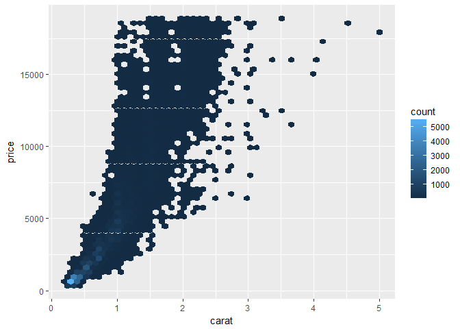
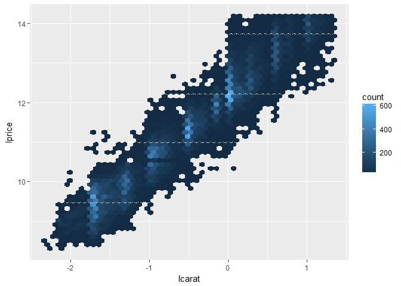
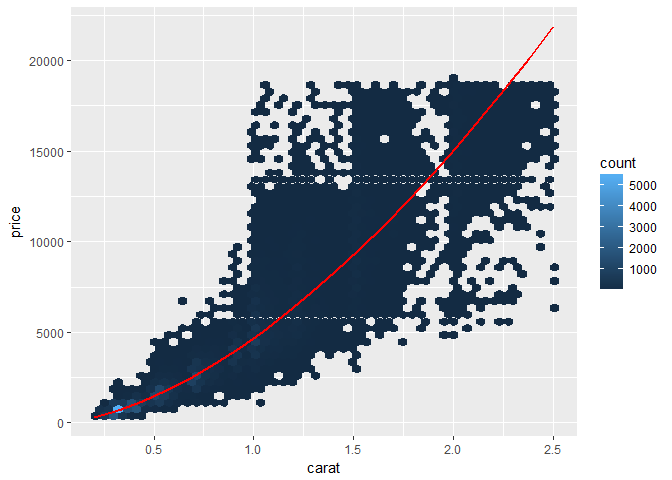
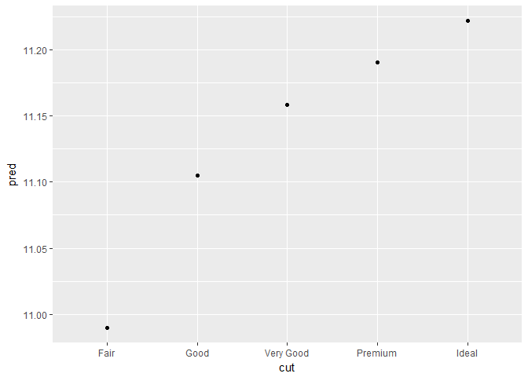
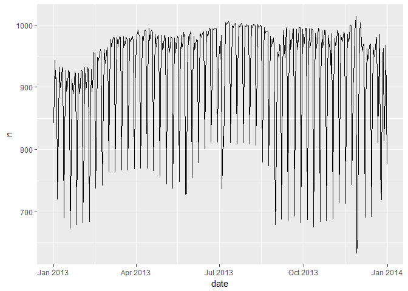
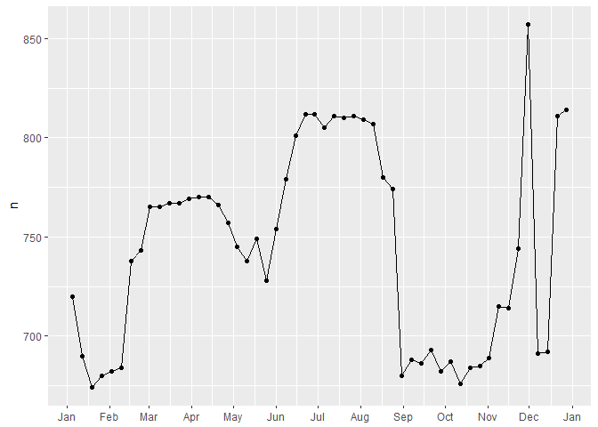
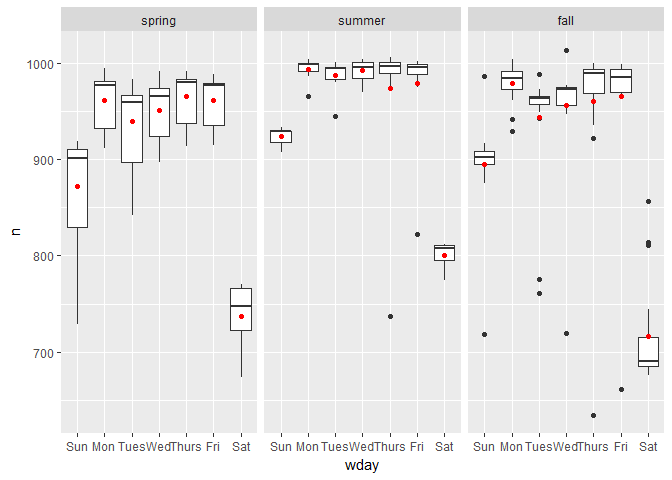

# October 13


# 24.2 Why are low quality diamonds more expensive?


```r
ggplot(diamonds, aes(carat, price)) + 
  geom_hex(bins = 50)
```

```
## Warning: package 'hexbin' was built under R version 3.4.2
```

<!-- -->

```r
diamonds2 <- diamonds %>% 
  filter(carat <= 2.5) %>% 
  mutate(lprice = log2(price), lcarat = log2(carat))
```

```
## Warning: package 'bindrcpp' was built under R version 3.4.1
```

```r
ggplot(diamonds2, aes(lcarat, lprice)) + 
  geom_hex(bins = 50)
```

<!-- -->

```r
mod_diamond <- lm(lprice ~ lcarat, data = diamonds2)

grid <- diamonds2 %>% 
  data_grid(carat = seq_range(carat, 20)) %>% 
  mutate(lcarat = log2(carat)) %>% 
  add_predictions(mod_diamond, "lprice") %>% 
  mutate(price = 2 ^ lprice)

#It looks like lower quality diamonds have higher prices because there is an important confounding variable: the weight (carat) of the diamond. 

ggplot(diamonds2, aes(carat, price)) + 
  geom_hex(bins = 50) + 
  geom_line(data = grid, colour = "red", size = 1)
```

<!-- -->

```r
diamonds2 <- diamonds2 %>% 
  add_residuals(mod_diamond, "lresid")

ggplot(diamonds2, aes(lcarat, lresid)) + 
  geom_hex(bins = 50)
```

<!-- -->

```r
#Importantly, we can now re-do our motivating plots using those residuals instead of price.

ggplot(diamonds2, aes(cut, lresid)) + geom_boxplot()
```

<!-- -->

```r
#To interpret the y axis, we need to think about what the residuals are telling us, and what scale they are on. A residual of -1 indicates that lprice was 1 unit lower than a prediction based solely on its weight. Based on 2^-1 = 1/2 Points with a value of -1 are half the expected price, and residuals with value 1 are twice the predicted price.
```

# 24.2.2 A more complicated model


```r
# For example, we could include color, cut, and clarity into the model so that we also make explicit the effect of these three categorical variables: 
mod_diamond2 <- lm(lprice ~ lcarat + color + cut + clarity, data = diamonds2)

# Fortunately, they’re currently all independent which means that we can plot them individually in four plots
grid <- diamonds2 %>% 
  data_grid(cut, .model = mod_diamond2) %>% 
  add_predictions(mod_diamond2)
grid
```

```
## # A tibble: 5 x 5
##         cut     lcarat color clarity     pred
##       <ord>      <dbl> <chr>   <chr>    <dbl>
## 1      Fair -0.5145732     G     SI1 10.98985
## 2      Good -0.5145732     G     SI1 11.10479
## 3 Very Good -0.5145732     G     SI1 11.15824
## 4   Premium -0.5145732     G     SI1 11.19055
## 5     Ideal -0.5145732     G     SI1 11.22187
```

```r
ggplot(grid, aes(cut, pred)) + 
  geom_point()
```

<!-- -->

```r
# If the model needs variables that you haven’t explicitly supplied, data_grid() will automatically fill them in with “typical” value.

diamonds2 <- diamonds2 %>% 
  add_residuals(mod_diamond2, "lresid2")

ggplot(diamonds2, aes(lcarat, lresid2)) + 
  geom_hex(bins = 50)
```

<!-- -->
# 24.2.3 Exercises

1. In the plot of lcarat vs. lprice, there are some bright vertical strips. What do they represent?
Diamond carats are likely to be rounded to more standard numbers
??What are the dotted white horizontal stripes??

2. If `log(price) = a_0 + a_1 * log(carat)`, what does that say about the relationship between price and carat?
log represents % change
if price goes up by 1%, carat will go up by a_1 * 1%

3. Extract the diamonds that have very high and very low residuals. Is there anything unusual about these diamonds? Are the particularly bad or good, or do you think these are pricing errors?

4. Does the final model, mod_diamonds2, do a good job of predicting diamond prices? Would you trust it to tell you how much to spend if you were buying a diamond?


```r
diamonds2 %>%
  add_predictions(mod_diamond2) %>%
  add_residuals(mod_diamond2) %>%
ggplot(aes(lcarat, lresid2)) + 
  geom_hex(bins = 50)
```

<!-- -->

# 24.3 What affects the number of daily flights?


```r
daily <- flights %>% 
  mutate(date = make_date(year, month, day)) %>% 
  group_by(date) %>% 
  summarise(n = n())

ggplot(daily, aes(date, n)) + 
  geom_line()
```

<!-- -->

```r
daily <- daily %>% 
  mutate(wday = wday(date, label = TRUE))
ggplot(daily, aes(wday, n)) + 
  geom_boxplot()
```

<!-- -->

```r
mod <- lm(n ~ wday, data = daily)

grid <- daily %>% 
  data_grid(wday) %>% 
  add_predictions(mod, "n")

ggplot(daily, aes(wday, n)) + 
  geom_boxplot() +
  geom_point(data = grid, colour = "red", size = 4)
```

<!-- -->

```r
daily <- daily %>% 
  add_residuals(mod)
daily %>% 
  ggplot(aes(date, resid)) + 
  geom_ref_line(h = 0) + 
  geom_line()
```

<!-- -->

## 24.3.2 Seasonal Saturday effect


```r
daily %>% 
  filter(wday == "Sat") %>% 
  ggplot(aes(date, n)) + 
    geom_point() + 
    geom_line() +
    scale_x_date(NULL, date_breaks = "1 month", date_labels = "%b")
```

<!-- -->

```r
term <- function(date) {
  cut(date, 
    breaks = ymd(20130101, 20130605, 20130825, 20140101),
    labels = c("spring", "summer", "fall") 
  )
}

daily <- daily %>% 
  mutate(term = term(date)) 

daily %>% 
  filter(wday == "Sat") %>% 
  ggplot(aes(date, n, colour = term)) +
  geom_point(alpha = 1/3) + 
  geom_line() +
  scale_x_date(NULL, date_breaks = "1 month", date_labels = "%b")
```

<!-- -->

```r
daily %>% 
  ggplot(aes(wday, n, colour = term)) +
    geom_boxplot()
```

<!-- -->

```r
mod1 <- lm(n ~ wday, data = daily)
mod2 <- lm(n ~ wday * term, data = daily)

daily %>% 
  gather_residuals(without_term = mod1, with_term = mod2) %>% 
  ggplot(aes(date, resid, colour = model)) +
    geom_line(alpha = 0.75)
```

<!-- -->

```r
grid <- daily %>% 
  data_grid(wday, term) %>% 
  add_predictions(mod2, "n")

ggplot(daily, aes(wday, n)) +
  geom_boxplot() + 
  geom_point(data = grid, colour = "red") + 
  facet_wrap(~ term)
```

<!-- -->

```r
#Our model is finding the mean effect, but we have a lot of big outliers, so mean tends to be far away from the typical value. We can alleviate this problem by using a model that is robust to the effect of outliers: MASS::rlm()

mod3 <- MASS::rlm(n ~ wday * term, data = daily)

daily %>% 
  add_residuals(mod3, "resid") %>% 
  ggplot(aes(date, resid)) + 
  geom_hline(yintercept = 0, size = 2, colour = "white") + 
  geom_line()
```

<!-- -->

## 24.3.3 Computed variables

it’s a good idea to bundle the creation of variables up into a function


```r
compute_vars <- function(data) {
  data %>% 
    mutate(
      term = term(date), 
      wday = wday(date, label = TRUE)
    )
}

wday2 <- function(x) wday(x, label = TRUE)
mod3 <- lm(n ~ wday2(date) * term(date), data = daily)
```

## 24.3.4 Time of year: an alternative approach


```r
library(splines)
mod <- MASS::rlm(n ~ wday * ns(date, 5), data = daily)

daily %>% 
  data_grid(wday, date = seq_range(date, n = 13)) %>% 
  add_predictions(mod) %>% 
  ggplot(aes(date, pred, colour = wday)) + 
    geom_line() +
    geom_point()
```

<!-- -->
# 24.3.5 Exercises

1. Use your Google sleuthing skills to brainstorm why there were fewer than expected flights on Jan 20, May 26, and Sep 1. (Hint: they all have the same explanation.) How would these days generalise to another year?

Sunday before Monday holidays

2. What do the three days with high positive residuals represent? How would these days generalise to another year?

daily %>% 
  top_n(3, resid)
#> # A tibble: 3 × 5
#>         date     n  wday resid   term
#>       <date> <int> <ord> <dbl> <fctr>
#> 1 2013-11-30   857   Sat 112.4   fall
#> 2 2013-12-01   987   Sun  95.5   fall
#> 3 2013-12-28   814   Sat  69.4   fall

High positive residuals = more flights than expected. These are weekends that are near common breaks like thanksgiving and winter break / new year's

3. Create a new variable that splits the wday variable into terms, but only for Saturdays, i.e. it should have Thurs, Fri, but Sat-summer, Sat-spring, Sat-fall. How does this model compare with the model with every combination of wday and term?

```r
daily2 <- daily %>% 
  mutate(wday2 = if_else(wday == "Sat", paste0("Sat-", term), as.character(wday)))

mod4 <- lm(n ~ wday2, data = daily2)
mod5 <- lm(n ~ wday * term, data = daily2)

daily2 %>% 
  gather_residuals(old = mod5, new = mod4) %>% 
  ggplot(aes(date, resid, color = interaction(term, model))) +
    geom_line(alpha = 0.55)
```

<!-- -->

The new model seems worse in summer and early Spring (residuals are farther away from 0)
In fall the models are pretty equal

4. Create a new wday variable that combines the day of week, term (for Saturdays), and public holidays. What do the residuals of that model look like?

```r
# How do we find all the public holidays? This seems annoying
```

5. What happens if you fit a day of week effect that varies by month (i.e. n ~ wday * month)? Why is this not very helpful?

Is this not helpful because it would be somewhat redundant with term? Month is like, an arbitrary boundary whereas term may have meaning behind it

6. What would you expect the model `n ~ wday + ns(date, 5)` to look like? Knowing what you know about the data, why would you expect it to be not particularly effective?

Didn't we already do this in the example?

7. We hypothesised that people leaving on Sundays are more likely to be business travellers who need to be somewhere on Monday. Explore that hypothesis by seeing how it breaks down based on distance and time: if it’s true, you’d expect to see more Sunday evening flights to places that are far away.

It’s a little frustrating that Sunday and Saturday are on separate ends of the plot. Write a small function to set the levels of the factor so that the week starts on Monday.


```r
library(forcats)
fct_relevel(daily2$wday, "Sun", after = Inf)
```

```
##   [1] Tues  Wed   Thurs Fri   Sat   Sun   Mon   Tues  Wed   Thurs Fri  
##  [12] Sat   Sun   Mon   Tues  Wed   Thurs Fri   Sat   Sun   Mon   Tues 
##  [23] Wed   Thurs Fri   Sat   Sun   Mon   Tues  Wed   Thurs Fri   Sat  
##  [34] Sun   Mon   Tues  Wed   Thurs Fri   Sat   Sun   Mon   Tues  Wed  
##  [45] Thurs Fri   Sat   Sun   Mon   Tues  Wed   Thurs Fri   Sat   Sun  
##  [56] Mon   Tues  Wed   Thurs Fri   Sat   Sun   Mon   Tues  Wed   Thurs
##  [67] Fri   Sat   Sun   Mon   Tues  Wed   Thurs Fri   Sat   Sun   Mon  
##  [78] Tues  Wed   Thurs Fri   Sat   Sun   Mon   Tues  Wed   Thurs Fri  
##  [89] Sat   Sun   Mon   Tues  Wed   Thurs Fri   Sat   Sun   Mon   Tues 
## [100] Wed   Thurs Fri   Sat   Sun   Mon   Tues  Wed   Thurs Fri   Sat  
## [111] Sun   Mon   Tues  Wed   Thurs Fri   Sat   Sun   Mon   Tues  Wed  
## [122] Thurs Fri   Sat   Sun   Mon   Tues  Wed   Thurs Fri   Sat   Sun  
## [133] Mon   Tues  Wed   Thurs Fri   Sat   Sun   Mon   Tues  Wed   Thurs
## [144] Fri   Sat   Sun   Mon   Tues  Wed   Thurs Fri   Sat   Sun   Mon  
## [155] Tues  Wed   Thurs Fri   Sat   Sun   Mon   Tues  Wed   Thurs Fri  
## [166] Sat   Sun   Mon   Tues  Wed   Thurs Fri   Sat   Sun   Mon   Tues 
## [177] Wed   Thurs Fri   Sat   Sun   Mon   Tues  Wed   Thurs Fri   Sat  
## [188] Sun   Mon   Tues  Wed   Thurs Fri   Sat   Sun   Mon   Tues  Wed  
## [199] Thurs Fri   Sat   Sun   Mon   Tues  Wed   Thurs Fri   Sat   Sun  
## [210] Mon   Tues  Wed   Thurs Fri   Sat   Sun   Mon   Tues  Wed   Thurs
## [221] Fri   Sat   Sun   Mon   Tues  Wed   Thurs Fri   Sat   Sun   Mon  
## [232] Tues  Wed   Thurs Fri   Sat   Sun   Mon   Tues  Wed   Thurs Fri  
## [243] Sat   Sun   Mon   Tues  Wed   Thurs Fri   Sat   Sun   Mon   Tues 
## [254] Wed   Thurs Fri   Sat   Sun   Mon   Tues  Wed   Thurs Fri   Sat  
## [265] Sun   Mon   Tues  Wed   Thurs Fri   Sat   Sun   Mon   Tues  Wed  
## [276] Thurs Fri   Sat   Sun   Mon   Tues  Wed   Thurs Fri   Sat   Sun  
## [287] Mon   Tues  Wed   Thurs Fri   Sat   Sun   Mon   Tues  Wed   Thurs
## [298] Fri   Sat   Sun   Mon   Tues  Wed   Thurs Fri   Sat   Sun   Mon  
## [309] Tues  Wed   Thurs Fri   Sat   Sun   Mon   Tues  Wed   Thurs Fri  
## [320] Sat   Sun   Mon   Tues  Wed   Thurs Fri   Sat   Sun   Mon   Tues 
## [331] Wed   Thurs Fri   Sat   Sun   Mon   Tues  Wed   Thurs Fri   Sat  
## [342] Sun   Mon   Tues  Wed   Thurs Fri   Sat   Sun   Mon   Tues  Wed  
## [353] Thurs Fri   Sat   Sun   Mon   Tues  Wed   Thurs Fri   Sat   Sun  
## [364] Mon   Tues 
## Levels: Mon < Tues < Wed < Thurs < Fri < Sat < Sun
```

```r
ggplot(daily2, aes(wday, n)) +
  geom_boxplot() + 
  facet_wrap(~ term)
```

<!-- -->

