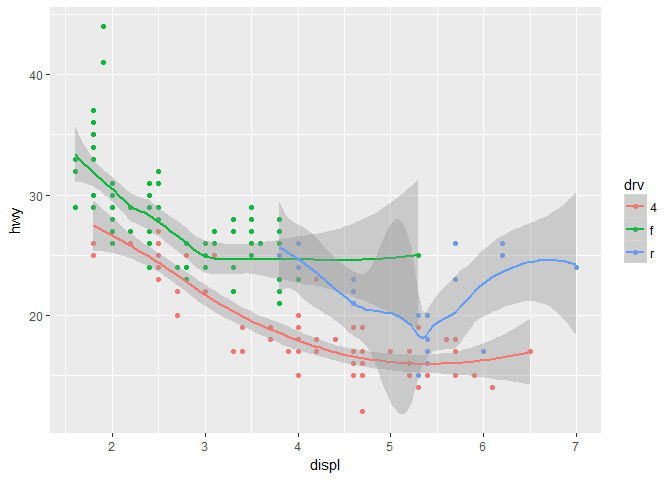

# R-club-May-3


```
## [1] "Libraries loaded: ggplot2, lme4, lmerTest, reshape2"
```

```
## [1] "Functions loaded: function.R"
```


1. Line chart: geom_smooth
Boxplot: geom_box
histogram: geom_histogram
area chart: geom_area
2. 

```r
ggplot(data = mpg, mapping = aes(x = displ, y = hwy, color = drv)) + 
  geom_point() + 
  geom_smooth(se = TRUE)
```

```
## `geom_smooth()` using method = 'loess'
```

<!-- -->

3. show.legend=FALSE would remove the legend from the graph. Maybe he wanted to have a smaller graph?
4. se displays the confidence interval if true
5. The graphs will look the same, because having all local parameters be the same is the same as having one global parameter. 

6. 

```r
ggplot(mpg, aes(displ, hwy)) + geom_point() + geom_smooth(se=FALSE)
```

```
## `geom_smooth()` using method = 'loess'
```

<!-- -->

```r
ggplot(mpg, aes(displ, hwy)) + geom_point() + geom_smooth(aes(group=drv), se=FALSE)
```

```
## `geom_smooth()` using method = 'loess'
```

<!-- -->

```r
ggplot(mpg, aes(displ, hwy, color=drv)) + geom_point() + geom_smooth(se=FALSE)
```

```
## `geom_smooth()` using method = 'loess'
```

<!-- -->

```r
ggplot(mpg, aes(displ, hwy)) + geom_point(aes(color=drv)) + geom_smooth(se=FALSE)
```

```
## `geom_smooth()` using method = 'loess'
```

<!-- -->

```r
ggplot(mpg, aes(displ, hwy)) + geom_point(aes(color=drv)) + geom_smooth(aes(linetype=drv),se=FALSE)
```

```
## `geom_smooth()` using method = 'loess'
```

<!-- -->

```r
ggplot(mpg, aes(displ, hwy)) + geom_point(color="white", size=4) + geom_point(aes(color=drv))
```

<!-- -->

## 3.7.1

1. stat_summary() default is geom_pointrange

```r
ggplot(diamonds) + geom_pointrange(aes(cut, depth), stat="summary", fun.ymin=min, fun.ymax=max, fun.y=median)
```

<!-- -->


2. geom_col is for plotting discrete x groups and continuous y values. geom_bar is for a single variable, and will plot the counts of that one variable. 

3. geom_bin + stat_bin, geom_bar + stat_bar, geom_boxplot + stat_boxplot, geom_density + stat_density.. etc the names are all similar. They probably do similar things. 

4. stat_smooth() computes y, ymin, ymax, and the se. It can create a different smoothing function depending on the formula or method. 

5. ? this one was confusing. It looks like prop normally takes the groupwise proportion of each group separately. If you say group = 1 then it will combine all of the groups for taking the total proportion.  

```r
ggplot(data = diamonds) + 
  geom_bar(mapping = aes(x = cut, y = ..prop..,group=1))
```

<!-- -->

```r
ggplot(data = diamonds) + 
  geom_bar(mapping = aes(x = cut, fill = color, y = ..prop.., group=1))
```

<!-- -->

## 3.8.1
1. This is overplotted. Use geom_jitter instead of geom_point
2. You can change the jitter to be more in the vertical or horizontal direction
3. geom_count solves overplotting by adjusting the size of each point to match the number of points that are there

```r
ggplot(data = mpg, mapping = aes(x = cty, y = hwy)) + 
  geom_point()
```

<!-- -->

```r
ggplot(data = mpg, mapping = aes(x = cty, y = hwy)) + 
  geom_count()
```

<!-- -->
4. Default is position="dodge"

```r
ggplot(data = mpg, aes(x = fl, y = hwy, color = class)) +
  geom_boxplot()
```

<!-- -->
## 3.9.1
1. 

```r
ggplot(mpg, aes(x = factor(1), fill = drv)) +
  geom_bar() + coord_polar(theta="y")
```

<!-- -->
2. labs() lets you add labels to axis, legends, title
3. coord_quickmap is a shorthand / simple case version of coord_map that perserves straight lines. coord_map takes into account the earth's spherical shape, using the "mercator" projection
4. It tells you that hwy is slightly higher than cty. It's not a 1:1 ratio, which is what the abline is showing. If you remove coord_fixed(), then the graph stretches along the x axis to fit the screen better, but the reference line isn't at a nice 45 degree angle. 

## 4.4
1. The i isn't dotted
2. 

```r
library(tidyverse)
ggplot(data=mpg) + geom_point(mapping=aes(x=displ, y=hwy))

filter(mpg, cyl==8)
filter(diamonds, carat > 3)
```
3. Shift+alt+k gives you the keyboard shortcuts menu. This can also be found under tools. 


## My own data

```r
LeafData<-read.csv("../../SALMON_leaf_data - Revised.csv")

#Convert petioleLength from factor to number
LeafData<-LeafData[!LeafData$petioleLength=="null",] 
LeafData$petioleLength<-as.numeric(as.character(LeafData$petioleLength))

#Convert rep from number to factor
LeafData$rep<-as.factor(LeafData$rep)

#Convert to inches
LeafData[LeafData$unit=="inch",c("petioleLength","bladeLength","bladeWidth","bladePerimeter")]<-sapply(LeafData[LeafData$unit=="inch",c("petioleLength","bladeLength","bladeWidth","bladePerimeter")],function(x) as.numeric(as.character(x)))*25.4
LeafData[LeafData$unit=="inch","bladeArea"]<-sapply(LeafData[LeafData$unit=="inch","bladeArea"],function(x) as.numeric(as.character(x)))*(25.4^2)

#Filter outliers
LeafData<-LeafData[LeafData$petioleLength<300,]

#hist(LeafData$petioleLength, main="Petiole Length", xlab="Petiole Length in Inches")
#Confirm chunk over
LeafData$treatment<-relevel(LeafData$treatment,ref="sun")
print("Conversion to inches and outlier removal complete")
```

```
## [1] "Conversion to inches and outlier removal complete"
```

#Genotype number / name conversion table

```
##    genotype1    genotype2
## 1          1          Col
## 2          2 Col for PCC1
## 3          3    PCC1-19-9
## 4          4    PCC1-25-4
## 5          5    PCC1-33-9
## 6          6     wrky33-1
## 7          7       pad4-1
## 8          8       xbat34
## 9          9       acd6-1
## 10        10       acd6-2
## 11        11 Col for acd6
## 12        12     cbp60g-1
## 13        13     cbp60g-2
## 14        14       pad3-1
## 15        15     wrky70-1
## 16        16        sard1
## 17        17       iqm1-2
## 18        18         aig1
```

```
## [1] "Genotype number to name conversion complete"
```

# Graphs Divided By Set


```r
#General function for plotting raw data. 
plotRawData <- function(data, trait, title){
  p <- ggplot(data=data, aes_string(x="treatment", y=trait, color="treatment"))
  p <- p + geom_jitter() 
  p <- p + stat_summary(fun.y="mean",geom="bar",alpha=0.5)
  p <- p + stat_summary(fun.data="calc.sem",geom="errorbar",position="dodge") 
  p <- p + facet_grid(.~genotype)
  p <- p + labs(title=title,x="treatment",y=trait)
  p <- p + theme(axis.text.x = element_blank(), axis.text.y = element_blank(), axis.ticks = element_blank())
  return(p)
}

#Loop for each set
for (letter in c("A", "B", "C", "D", "F")) {
  for(trait in c("petioleLength", "petiole_bladeLength", "bladeArea")) {
     assign("currentSet", get(paste("LeafData.", letter, sep="")))
     p <- ggplot(data=currentSet, aes_string(x="treatment", y=trait, color="treatment"))
     p <- p + geom_jitter() 
     p <- p + stat_summary(fun.y="mean",geom="bar",alpha=0.5)
     p <- p + stat_summary(fun.data="calc.sem",geom="errorbar",position="dodge") 
     p <- p + facet_grid(.~genotype)
     p <- p + labs(title=paste(trait, "Set", letter),x="treatment",y=trait)
     p <- p + theme(axis.text.x = element_blank(), axis.text.y = element_blank(), axis.ticks = element_blank())
     ggsave(paste("rawdata_", trait, "_Set", letter, ".png", sep=""), path=paste(getwd(), "/Graph Images/RawData", sep=""),height=10, width=11, unit="in")
  }
  }
```

