# September 20

Sept 20: Chapter 22 (it is short) + Chapter 23.1 - 23.2


```r
library(tidyverse)
```

```
## Loading tidyverse: ggplot2
## Loading tidyverse: tibble
## Loading tidyverse: tidyr
## Loading tidyverse: readr
## Loading tidyverse: purrr
## Loading tidyverse: dplyr
```

```
## Warning: package 'purrr' was built under R version 3.4.1
```

```
## Warning: package 'dplyr' was built under R version 3.4.1
```

```
## Conflicts with tidy packages ----------------------------------------------
```

```
## filter(): dplyr, stats
## lag():    dplyr, stats
```

```r
library(modelr)
options(na.action = na.warn)
```


```r
models <- tibble(
  a1 = runif(250, -20, 40),
  a2 = runif(250, -5, 5)
)

ggplot(sim1, aes(x, y)) + 
  geom_abline(aes(intercept = a1, slope = a2), data = models, alpha = 1/4) +
  geom_point() 
```

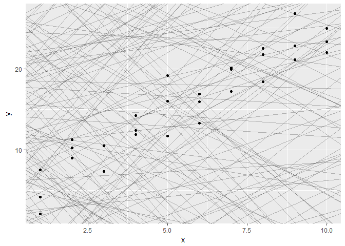<!-- -->


```r
model1 <- function(a, data) {
  a[1] + data$x * a[2]
}
model1(c(7, 1.5), sim1)
```

```
##  [1]  8.5  8.5  8.5 10.0 10.0 10.0 11.5 11.5 11.5 13.0 13.0 13.0 14.5 14.5
## [15] 14.5 16.0 16.0 16.0 17.5 17.5 17.5 19.0 19.0 19.0 20.5 20.5 20.5 22.0
## [29] 22.0 22.0
```


```r
measure_distance <- function(mod, data) {
  diff <- data$y - model1(mod, data)
  sqrt(mean(diff ^ 2))
}
measure_distance(c(7, 1.5), sim1)
```

```
## [1] 2.665212
```

```r
sim1_dist <- function(a1, a2) {
  measure_distance(c(a1, a2), sim1)
}

models <- models %>% 
  mutate(dist = purrr::map2_dbl(a1, a2, sim1_dist))
```

```
## Warning: package 'bindrcpp' was built under R version 3.4.1
```

```r
models
```

```
## # A tibble: 250 x 3
##             a1         a2      dist
##          <dbl>      <dbl>     <dbl>
##  1  23.9211084  3.7567791 29.565443
##  2  -4.9840238  1.3876285 13.170060
##  3  38.4230365  4.9198195 50.696962
##  4  19.0230184  2.0813172 15.116809
##  5  -6.5553726  3.1760809  6.003425
##  6   6.6822736  1.7849441  2.471017
##  7 -10.1665293 -1.9100896 37.983303
##  8   0.5769674 -3.6462023 38.678896
##  9  39.7944930 -0.6966369 22.031720
## 10 -12.1133943  0.5233774 25.215407
## # ... with 240 more rows
```

```r
ggplot(models, aes(a1, a2)) +
  geom_point(data = filter(models, rank(dist) <= 10), size = 4, colour = "red") +
  geom_point(aes(colour = -dist))
```

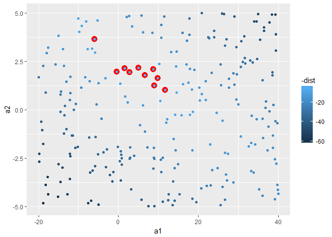<!-- -->


```r
grid <- expand.grid(
  a1 = seq(-5, 20, length = 25),
  a2 = seq(1, 3, length = 25)
  ) %>% 
  mutate(dist = purrr::map2_dbl(a1, a2, sim1_dist))

grid %>% 
  ggplot(aes(a1, a2)) +
  geom_point(data = filter(grid, rank(dist) <= 10), size = 4, colour = "red") +
  geom_point(aes(colour = -dist)) 
```

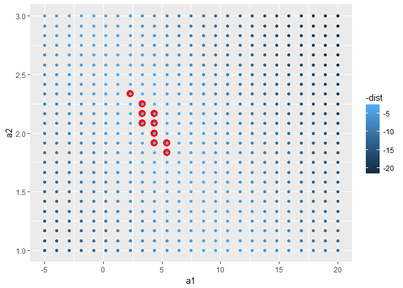<!-- -->


```r
best <- optim(c(0, 0), measure_distance, data = sim1)
best$par
```

```
## [1] 4.222248 2.051204
```

```r
sim1_mod <- lm(y ~ x, data = sim1)
coef(sim1_mod)
```

```
## (Intercept)           x 
##    4.220822    2.051533
```


# 23.2.1 Exercises

1. One downside of the linear model is that it is sensitive to unusual values because the distance incorporates a squared term. Fit a linear model to the simulated data below, and visualise the results. Rerun a few times to generate different simulated datasets. What do you notice about the model?


```r
sim1a <- tibble(
  x = rep(1:10, each = 3),
  y = x * 1.5 + 6 + rt(length(x), df = 2)
)

ggplot(data = sim1a, aes(x, y)) + geom_point()
```

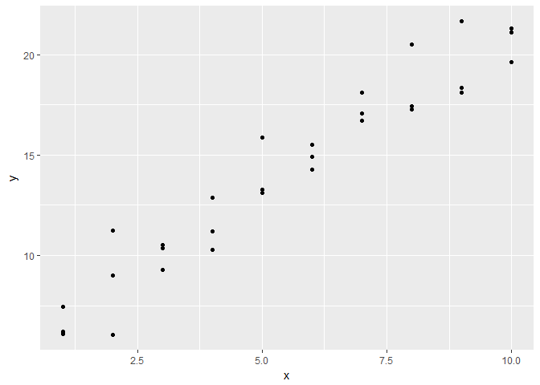<!-- -->

```r
sim1a_model <- lm(y~x, data=sim1a)
coef(sim1a_model)
```

```
## (Intercept)           x 
##    5.456852    1.581898
```

2. One way to make linear models more robust is to use a different distance measure. For example, instead of root-mean-squared distance, you could use mean-absolute distance:


```r
measure_distance <- function(mod, data) {
  diff <- data$y - model1(mod, data)
  mean(abs(diff))
}
```

Use optim() to fit this model to the simulated data above and compare it to the linear model. ? what are they asking


```r
best <- optim(c(0, 0), measure_distance, data = sim1a)
best$par
```

```
## [1] 5.67035 1.54231
```

3. One challenge with performing numerical optimisation is that it’s only guaranteed to find one local optima. What’s the problem with optimising a three parameter model like this?


```r
model1 <- function(a, data) {
  a[1] + data$x * a[2] + a[3]
}
```

a[1] and a[3] are sort of "equivalent" since they're both added in the same way. So you can find out what a[1] + a[3] is optimized at, but you can't find out how it's spread between the two terms.


# ##################

To visualise the predictions from a model, we start by generating an evenly spaced grid of values that covers the region where our data lies.


```r
grid <- sim1 %>% 
  data_grid(x) 
```

Next we add predictions. We’ll use modelr::add_predictions() which takes a data frame and a model. It adds the predictions from the model to a new column in the data frame:


```r
grid <- grid %>%
  add_predictions(sim1_mod)
```

Plot your predictive model


```r
ggplot(sim1, aes(x)) +
  geom_point(aes(y = y)) +
  geom_line(aes(y = pred), data = grid, colour = "red", size = 1)
```

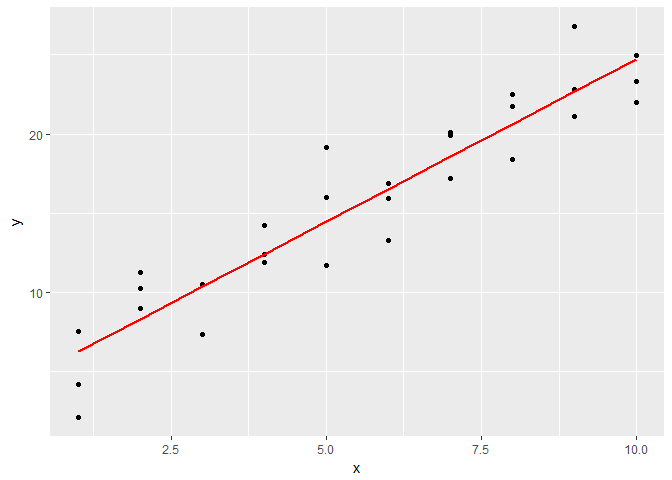<!-- -->

# 23.3.2 Residuals


```r
sim1 <- sim1 %>% 
  add_residuals(sim1_mod)
sim1
```

```
## # A tibble: 30 x 3
##        x         y        resid
##    <int>     <dbl>        <dbl>
##  1     1  4.199913 -2.072442018
##  2     1  7.510634  1.238279125
##  3     1  2.125473 -4.146882207
##  4     2  8.988857  0.664969362
##  5     2 10.243105  1.919217378
##  6     2 11.296823  2.972935148
##  7     3  7.356365 -3.019056466
##  8     3 10.505349  0.129928252
##  9     3 10.511601  0.136179642
## 10     4 12.434589  0.007634878
## # ... with 20 more rows
```

```r
#Plot the spread of the residuals
ggplot(sim1, aes(resid)) + 
  geom_freqpoly(binwidth = 0.5)
```

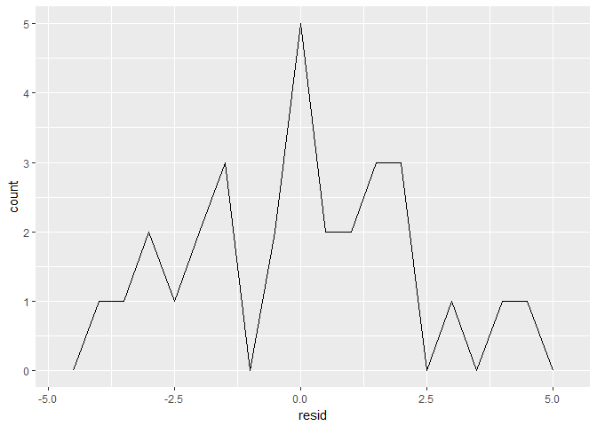<!-- -->

```r
#Recreate plot using residuals instead of original predictor. If looks random, is good
ggplot(sim1, aes(x, resid)) + 
  geom_ref_line(h = 0) +
  geom_point() 
```

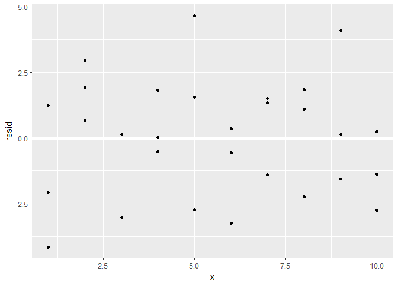<!-- -->


# 23.3.3 Exercises

1. Instead of using lm() to fit a straight line, you can use loess() to fit a smooth curve. Repeat the process of model fitting, grid generation, predictions, and visualisation on sim1 using loess() instead of lm(). How does the result compare to geom_smooth()? They're the same! 

```r
sim1_mod2 <- loess(y ~ x, data = sim1)

grid2 <- sim1 %>% 
  data_grid(x) 

grid2 <- grid2 %>%
  add_predictions(sim1_mod2)

ggplot(sim1, aes(x)) +
  geom_point(aes(y = y)) +
  geom_line(aes(y = pred), data = grid2, colour = "red", size = 1)
```

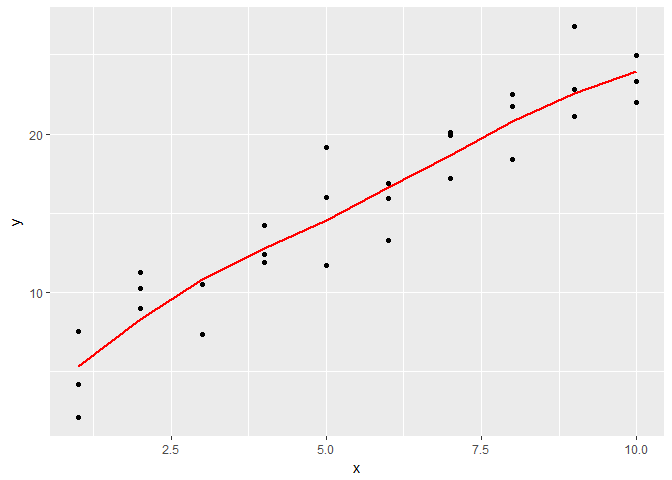<!-- -->

```r
ggplot(sim1, aes(x)) + 
  geom_point(aes(y = y)) +
  geom_smooth(aes(y = y))
```

```
## `geom_smooth()` using method = 'loess'
```

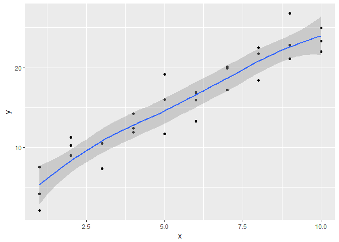<!-- -->


2. add_predictions() is paired with gather_predictions() and spread_predictions(). How do these three functions differ?
From the description: "add_prediction adds a single new column, .pred, to the input data. spread_predictions adds one column for each model. gather_prections adds two columns .model and .pred, and repeats the input rows for each model"

Gather and spread will be for fitting multiple models. Each just puts the data in a different format

3. What does geom_ref_line() do? What package does it come from? Why is displaying a reference line in plots showing residuals useful and important?

It is from modelr. You can use it to easily compare graphs visually, like when you need to examine residuals and variances to look for any bias

4. Why might you want to look at a frequency polygon of absolute residuals? What are the pros and cons compared to looking at the raw residuals?

The freq polygon lets you easily see the spread of the variances and see if it varies depending on X. For example, it would be a problem if at bigger values of X, you also have bigger variances. 

# 23.4 Formulas and model families

1. What happens if you repeat the analysis of sim2 using a model without an intercept. What happens to the model equation? What happens to the predictions?


```r
# ?formula

mod2 <- lm(y ~ x -1, data = sim2)

grid <- sim2 %>% 
  data_grid(x) %>% 
  add_predictions(mod2)
grid
```

```
## # A tibble: 4 x 2
##       x     pred
##   <chr>    <dbl>
## 1     a 1.152166
## 2     b 8.116039
## 3     c 6.127191
## 4     d 1.910981
```

```r
ggplot(sim2, aes(x)) + 
  geom_point(aes(y = y)) +
  geom_point(data = grid, aes(y = pred), colour = "red", size = 4)
```

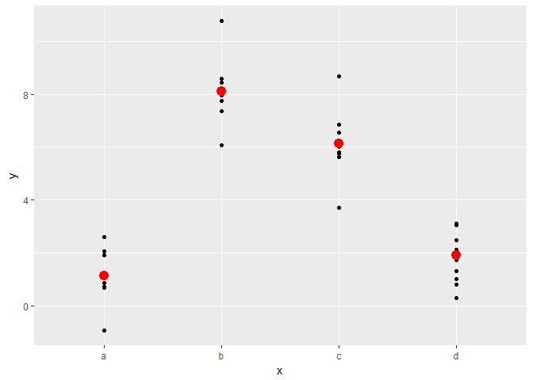<!-- -->
It is exactly the same? 

2. Use model_matrix() to explore the equations generated for the models I fit to sim3 and sim4. Why is * a good shorthand for interaction?


```r
mod1 <- lm(y ~ x1 + x2, data = sim3)
mod2 <- lm(y ~ x1 * x2, data = sim3)
df <- tribble(
  ~y, ~x, ~x2,
   1,  1, 1, 
   2,  2, 2, 
   3,  3, 3
)
model_matrix(df, y ~ x * x2)
```

```
## # A tibble: 3 x 4
##   `(Intercept)`     x    x2 `x:x2`
##           <dbl> <dbl> <dbl>  <dbl>
## 1             1     1     1      1
## 2             1     2     2      4
## 3             1     3     3      9
```


3. Using the basic principles, convert the formulas in the following two models into functions. (Hint: start by converting the categorical variable into 0-1 variables.)


```r
mod1 <- lm(y ~ x1 + x2, data = sim3)
mod2 <- lm(y ~ x1 * x2, data = sim3)

# mod1: y = a + a1 * x1 + a2 * x2
# mod2: y = a0 + a1 * x1 + a2 * x2 + a12 * x1 * x2
```

4. For sim4, which of mod1 and mod2 is better? I think mod2 does a slightly better job at removing patterns, but it’s pretty subtle. Can you come up with a plot to support my claim?


```r
mod1 <- lm(y ~ x1 + x2, data = sim4)
mod2 <- lm(y ~ x1 * x2, data = sim4)

grid <- sim4 %>%
  data_grid(x1, x2) %>%
  gather_predictions(mod1, mod2)

grid <- subset(grid, near(x2, 1))

ggplot(sim4, aes(x1, y, colour = x2)) + 
  geom_point() +
  geom_line(data = subset(grid, near(x2, 1)), aes(y = pred)) + 
  geom_line(data = subset(grid, near(x2, -1)), aes(y = pred)) + 
  geom_line(data = subset(grid, near(x2, -.55, tol = 0.02)), aes(y = pred)) + 
  geom_line(data = subset(grid, near(x2, .55, tol = 0.02)), aes(y = pred)) + 
  facet_wrap(~ model)
```

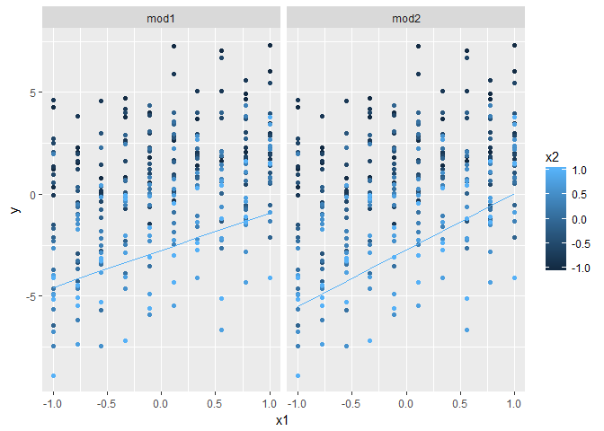<!-- -->

